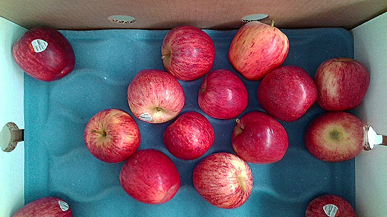
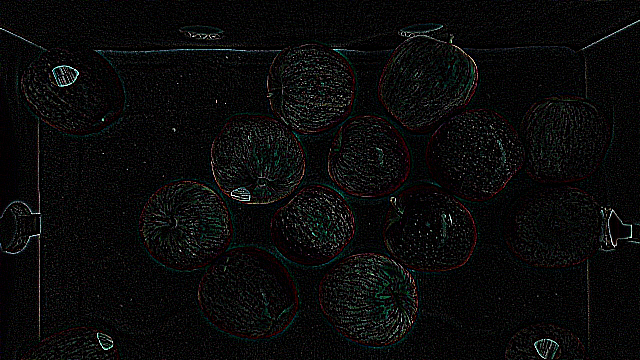

# **Filtering**

Dr Frazer Noble

---

# **Introduction**

In this presentation, I will describe:
- How to use OpenCV to apply a filter to an image.

---

# **Requirements**

To follow along with this tutorial, you will need the following tools:
- [Python 3.8.6](https://www.python.org/).
- [Visual Studio Code 1.53.1](https://code.visualstudio.com/).

You will also need to install the following Python packages:
- [OpenCV](https://pypi.org/project/opencv-python/).
- [NumPy](https://pypi.org/project/numpy/).

It is assumed that you are using Windows; however, these instructions should be easily adapted to Linux.

---

# **Getting Started**

Open Visual Studio Code. To open the app: Open the Start menu, type `Visual Studio Code`, and then select the app.

Open the Explorer tab. To display the tab: Left click `View > Explorer` or press <kbd>Ctrl</kbd>+<kbd>Shift</kbd>+<kbd>E</kbd>. This will display the Explorer tab.

Left click on the `Open Folder` button. This will display the Open Folder prompt. Browse to the following directory:

```
C:/Users/%USER%/Documents
```

*Note: Replace `%USER%` with your own username. My username is fknoble; hence, the path is `C:/Users/fknoble/Documents`.*

---

In `C:/Users/%USER%/Documents` create a new folder named `opencv_02`. To create a new folder: Right click in the Explorer tab, left click `New Folder`, and rename it.

In `C:/Users/%USER%/Documents/opencv_02` create a new folder named `data`. Download `apples.PNG` from [here](https://github.com/DrFKNoble/machine_vision_tutorials/blob/master/03_filtering/images/01/01.PNG); save it in `C:/Users/%USER%/Documents/opencv_02/data`.

In `C:/Users/%USER%/Documents/opencv_02` create new files named `filter.py`. To create a new file: Right click on `/opencv_02` in the Explorer tab, left click `New File`, and rename it. The file will open automatically.

---

`/opencv_02` should contain the following files and folders:

```
/opencv_02
    /data
        apple.PNG
    filter.py
```

---

# **`filter.py`**

Type the following code into `filter.py`:

```python
import cv2 as cv
import numpy as np
```

OpenCV's Python module `cv2` is imported as `cv` and NumPy's Python module `numpy` is imported as `np`.

---

Type the following code into `filter.py`:

```python
def main():

    img = cv.imread('data/apples.PNG')

    if img is None:
        print('ERROR::CV::Could not read image.')
        return 1
```

This begins `main()`'s definition. `imread()` reads an image from a directory and assigns the results to array `img`. If the array is empty, a message is displayed and `main()` returns 1.

---

Type the following code into `filter.py`:

```python
    rows, cols, channels = img.shape
    
    rows = rows // 2
    cols = cols // 2

    img = cv.resize(img, (cols, rows))

    cv.imshow('img', img)
    cv.waitKey(1)
```

`img`'s shape is assigned to integers `rows`, `cols`, and `channels`. `rows` and `cols` are divided by 2 (rounded down) and the results assigned to themselves. `resize()` resizes `img` to shape `cols` x `rows` and the result is assigned to itself. The array is then displayed in the `img` window.

---


*Figure:* The `img` array.

---

Type the following code into `filter.py`:

```python
    kernel = np.float32([0, 0, 0, 0, 1, 0, 0, 0, 0])
    kernel = kernel.reshape((3, 3))

    I_img = cv.filter2D(img, cv.CV_8UC3, kernel)

    cv.imshow('I_img', I_img)
    cv.waitKey(1)
    cv.imwrite('data/I_img.PNG', I_img)
```

`float32()` creates an array of the identity kernel's values and assigns it to array `kernel`. `reshape()` reshapes `kernel` into a 3 x 3 array. `filter2D()` applies the kernel to `img` and assigns the results to `I_img`. The array is then displayed in the `I_img` window and saved as `I_img.PNG` in `/data`.

---

  
*Figure:* (Left) The `img` array; and (Right) `img` after `kernel` is applied to it.

---

Type the following code into `filter.py`:

```python
    kernel = np.float32([0, -1, 0, -1, 5, -1, 0, -1, 0])
    kernel = kernel.reshape((3, 3))

    sharp_img = cv.filter2D(img, cv.CV_8UC3, kernel)

    cv.imshow('sharp_img', sharp_img)
    cv.waitKey(1)
    cv.imwrite('data/sharp_img.PNG', sharp_img)
```

`float32()` creates an array of the sharpen kernel's values and assigns it to array `kernel`. `reshape()` reshapes `kernel` into a 3 x 3 array. `filter2D()` applies the kernel to `img` and assigns the results to `sharp_img`. The array is then displayed in the `sharp_img` window and saved as `sharp_img.PNG` in `/data`.

---

  
*Figure:* (Left) The `img` array; and (Right) `img` after `kernel` is applied to it.

---

Type the following code into `filter.py`:

```python
    kernel = 1.0/9.0 * np.float32([1, 1, 1, 1, 1, 1, 1, 1, 1])
    kernel = kernel.reshape((3, 3))

    box_img = cv.filter2D(img, cv.CV_8UC3, kernel)

    cv.imshow('box_img', box_img)
    cv.waitKey(1)
    cv.imwrite('data/box_img.PNG', box_img)
```

`float32()` creates an array of the box kernel's values and assigns it to array `kernel`. `reshape()` reshapes `kernel` into a 3 x 3 array. `filter2D()` applies the kernel to `img` and assigns the results to `box_img`. The array is then displayed in the `box_img` window and saved as `box_img.PNG` in `/data`.

---

  
*Figure:* (Left) The `img` array; and (Right) `img` after `kernel` is applied to it.

---

Type the following code into `filter.py`:

```python
    kernel = 1.0/16.0 * np.float32([1, 2, 1, 2, 4, 2, 1, 2, 1])
    kernel = kernel.reshape((3, 3))

    gaussian_img = cv.filter2D(img, cv.CV_8UC3, kernel)

    cv.imshow('gaussian_img', gaussian_img)
    cv.waitKey(1)
    cv.imwrite('data/gaussian_img.PNG', gaussian_img)
```

`float32()` creates an array of the gaussian kernel's values and assigns it to array `kernel`. `reshape()` reshapes `kernel` into a 3 x 3 array. `filter2D()` applies the kernel to `img` and assigns the results to `gaussian_img`. The array is then displayed in the `gaussian_img` window and saved as `gaussian_img.PNG` in `/data`.

---

  
*Figure:* (Left) The `img` array; and (Right) `img` after `kernel` is applied to it.

---

Type the following code into `filter.py`:

```python
    kernel = np.float32([-1, -1, -1, -1, 8, -1, -1, -1, -1])
    kernel = kernel.reshape((3, 3))

    edge_img = cv.filter2D(img, cv.CV_8UC3, kernel)
  
    cv.imshow('edge_img', edge_img)
    cv.waitKey(0)
    cv.imwrite('data/edge_img.PNG', edge_img)

    cv.destroyAllWindows()

    return 0
```

`float32()` creates an array of the edge detection kernel's values and assigns it to array `kernel`. `reshape()` reshapes `kernel` into a 3 x 3 array. `filter2D()` applies the kernel to `img` and assigns the results to `edge_img`. The array is then displayed in the `edge_img` window and saved as `edge_img.PNG` in `/data`.

---

  
*Figure:* (Left) The `img` array; and (Right) `img` after `kernel` is applied to it.

---

Type the following code into `filter.py`:

```python
if __name__ == '__main__':

    main()
```

`main()` will be called when the `filter.py` is run.

---

# **Run `filter.py`**

Open a new terminal in Visual Studio Code. To open a new terminal: Left click `View > Terminal` or press <kbd>Ctrl</kbd>+<kbd>`</kbd>.

Type the following commands into the terminal and then press <kbd>Enter</kbd> after each one:

```
cd ./opencv_02
python filter.py
```

This will change the current directory to the `/opencv_02` sub-directory and then run `filter.py`.

Press any key to close the windows and stop `filter.py`.

---

# **Conclusion**

In this presentation, I have described:
- How to use OpenCV to apply a filter to an image.

---

# **References**

1. [https://docs.opencv.org/](https://docs.opencv.org/).
