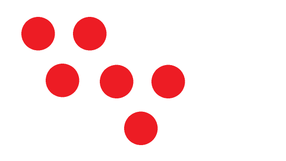
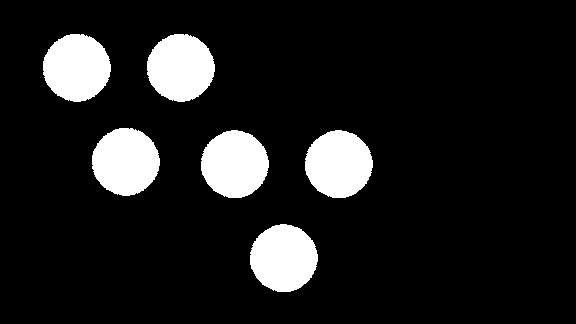
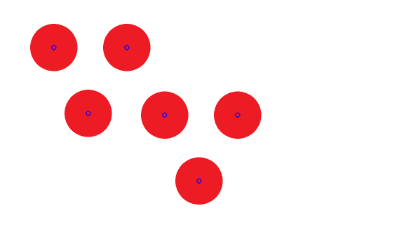

# **Feature Detection**

Dr Frazer Noble

---

# **Introduction**

In this presentation, I will describe:
- How to use OpenCV to detect features in an image.

---

# **Requirements**

To follow along with this tutorial, you will need the following tools:
- [Python 3.8.6](https://www.python.org/).
- [Visual Studio Code 1.53.1](https://code.visualstudio.com/).

You will also need to install the following Python packages:
- [OpenCV](https://pypi.org/project/opencv-python/).
- [NumPy](https://pypi.org/project/numpy/).

It is assumed that you are using Windows; however, these instructions should be easily adapted to Linux.

---

# **Getting Started**

Open Visual Studio Code. To open the app: Open the Start menu, type `Visual Studio Code`, and then select the app.

Open the Explorer tab. To display the tab: Left click `View > Explorer` or press <kbd>Ctrl</kbd>+<kbd>Shift</kbd>+<kbd>E</kbd>. This will display the Explorer tab.

Left click on the `Open Folder` button. This will display the Open Folder prompt. Browse to the following directory:

```
C:/Users/%USER%/Documents
```

*Note: Replace `%USER%` with your own username. My username is fknoble; hence, the path is `C:/Users/fknoble/Documents`.*

---

In `C:/Users/%USER%/Documents` create a new folder named `opencv_10`. To create a new folder: Right click in the Explorer tab, left click `New Folder`, and rename it.

In `C:/Users/%USER%/Documents/opencv_10` create a new folder named `data`. Download `apples.PNG` and `red_circles.PNG` from [here](images/01/); save them in `C:/Users/%USER%/Documents/opencv_10/data`.

In `C:/Users/%USER%/Documents/opencv_10` create new files named `simple.py` and `detect.py`. To create a new file: Right click on `/opencv_10` in the Explorer tab, left click `New File`, and rename it. The file will open automatically.

---

`/opencv_10` should contain the following files and folders:

```
/opencv_10
    /data
        apples.PNG
        red_circles.PNG
    detect.py
    simply.py
```

---

# **`simple.py`**

Type the following code into `simple.py`:

```python
import cv2 as cv
import numpy as np
```

OpenCV's Python module `cv2` is imported as `cv` and NumPy's Python module `numpy` is imported as `np`.

---

Type the following code into `simple.py`:

```python
def main():

    img = cv.imread('data/red_circles.PNG')

    if img is None:
        print('ERROR::CV::Could not read image.')
        return 1
```

This begins `main()`'s definition. `imread()` reads an image from a directory and assigns the results to array `img`. If the array is empty, a message is displayed and `main()` returns 1.

---

Type the following code into `simple.py`:

```python
    rows, cols, channels = img.shape
    
    rows = rows // 2
    cols = cols // 2

    img = cv.resize(img, (cols, rows))

    cv.imshow('img', img)
    cv.waitKey(1)
```

`img`'s shape is assigned to integers `rows`, `cols`, and `channels`. `rows` and `cols` are divided by 2 (rounded down) and the results assigned to themselves. `resize()` resizes `img` to shape `cols` x `rows` and the result is assigned to itself. The array is then displayed in the `img` window.

---


*Figure:* The `img` array.

---

Type the following code into `simple.py`:

```python
    red_ub = cv.inRange(img, (0, 20, 20), (50, 255, 255))
    red_lb = cv.inRange(img, (130, 20, 20), (180, 255, 255))
    red = cv.bitwise_or(red_ub, red_lb)

    cv.imshow('red', red)
    cv.waitKey(1)
    cv.imwrite('data/red.PNG', red)
```

`inRange()` segments `img`, identifying pixels in the red hue range and assigning them to arrays `red_ub` and `red_lb`. `bitwise_or()` or's the two arrays together and assigns the results to array `red`.

---


*Figure:* The `red` array.

---

Type the following code into `simple.py`:

```python
    params = cv.SimpleBlobDetector_Params()
    
    params.filterByColor = True
    params.blobColor = 255
```

`SimpleBlobDetector_Params()` creates an instance of the `blob` detector's parameters and assigns it to variable `params`. `params`'s `filterByColor` property is set to True and its `blobColor` property is set to 255. This will make a detector detect a light blob on a dark background.

---

Type the following code into `simple.py`:

```python
    simple = cv.SimpleBlobDetector_create(parameters=params)
    kp = simple.detect(red, None)
    
    simple_img = cv.drawKeypoints(img, kp, None, color=[255, 0, 0])

    cv.imshow("simple_img", simple_img)
    cv.waitKey(0)
    cv.imwrite("data/simple_img.PNG", simple_img)

    cv.destroyAllWindows()

    return 0
```

 `SimpleBlobDetector_create()` creates an instance of the `blob` feature detector and assigns it to variable `simple`. `simple`'s `detect()` detects keypoints in `img` and assigns them to keypoints `kp`. `drawKeypoints()` draws the keypoints on `img` and assigns it to array `simple_img`. The array is then displayed in the `simple_img` window and saved as `simple_img.PNG` in `/data`.

---


*Figure:* The `simple_img` array.

---

Type the following code into `simple.py`:

```python
if __name__ == '__main__':
    
    main()
```

`main()` will be called when the `simple.py` is run.

---

# **Run `simple.py`**

Open a new terminal in Visual Studio Code. To open a new terminal: Left click `View > Terminal` or press <kbd>Ctrl</kbd>+<kbd>`</kbd>.

Type the following commands into the terminal and then press <kbd>Enter</kbd> after each one:

```
cd ./opencv_10
python simple.py
```

This will change the current directory to the `/opencv_10` sub-directory and then run `simple.py`.

Press any key to close the windows and stop `simple.py`.

---

# **`detect.py`**

Type the following code into `detect.py`:

```python
import cv2 as cv
import numpy as np
```

OpenCV's Python module `cv2` is imported as `cv` and NumPy's Python module `numpy` is imported as `np`.

---

Type the following code into `detect.py`:

```python
def main():

    img = cv.imread('data/apples.PNG')

    if img is None:
        print('ERROR::CV::Could not read image.')
        return 1
```

This begins `main()`'s definition. `imread()` reads an image from a directory and assigns the results to array `img`. If the array is empty, a message is displayed and `main()` returns 1.

---

Type the following code into `detect.py`:

```python
    rows, cols, channels = img.shape
    
    rows = rows // 2
    cols = cols // 2

    img = cv.resize(img, (cols, rows))

    cv.imshow('img', img)
    cv.waitKey(1)
```

`img`'s shape is assigned to integers `rows`, `cols`, and `channels`. `rows` and `cols` are divided by 2 (rounded down) and the results assigned to themselves. `resize()` resizes `img` to shape `cols` x `rows` and the result is assigned to itself. The array is then displayed in the `img` window.

---


*Figure:* The `img` array.

---

Type the following code into `detect.py`:

```python
    kaze = cv.KAZE_create()
    kp = kaze.detect(img, None)

    kaze_img = cv.drawKeypoints(img, kp, None, color=[0, 0, 255])

    cv.imshow("akaze_img", kaze_img)
    cv.waitKey(1)
    cv.imwrite("data/kaze_img.PNG", kaze_img)
```

 `KAZE_create()` creates an instance of the `KAZE` feature detector and assigns it to variable `kaze`. `kaze`'s `detect()` detects keypoints in `img` and assigns them to keypoints `kp`. `drawKeypoints()` draws the keypoints on `img` and assigns it to array `kaze_img`. The array is then displayed in the `kaze_img` window and saved as `kaze_img.PNG` in `/data`.

---


*Figure:* The `kaze_img` array.

---

Type the following code into `detect.py`:

```python
    akaze = cv.AKAZE_create()
    kp = akaze.detect(img, None)

    akaze_img = cv.drawKeypoints(img, kp, None, color=[0, 0, 255])

    cv.imshow("akaze_img", akaze_img)
    cv.waitKey(1)
    cv.imwrite("data/akaze_img.PNG", akaze_img)
```

 `AKAZE_create()` creates an instance of the `AKAZE` feature detector and assigns it to variable `akaze`. `akaze`'s `detect()` detects keypoints in `img` and assigns them to keypoints `kp`. `drawKeypoints()` draws the keypoints on `img` and assigns it to array `akaze_img`. The array is then displayed in the `akaze_img` window and saved as `akaze_img.PNG` in `/data`.

---


*Figure:* The `akaze_img` array.

---

Type the following code into `detect.py`:

```python
    fast = cv.FastFeatureDetector_create()
    kp = fast.detect(img, None)

    fast_img = cv.drawKeypoints(img, kp, None, color=[0, 0, 255])

    cv.imshow("fast_img", fast_img)
    cv.waitKey(1)
    cv.imwrite("data/fast_img.PNG", fast_img)
```

 `FastFeatureDetector_create()` creates an instance of the `FAST` feature detector and assigns it to variable `fast`. `fast`'s `detect()` detects keypoints in `img` and assigns them to keypoints `kp`. `drawKeypoints()` draws the keypoints on `img` and assigns it to array `fast_img`. The array is then displayed in the `fast_img` window and saved as `fast_img.PNG` in `/data`.

---


*Figure:* The `fast_img` array.

---

Type the following code into `detect.py`:

```python
    brisk = cv.BRISK_create()
    kp = brisk.detect(img, None)

    brisk_img = cv.drawKeypoints(img, kp, None, color=[0, 0, 255])

    cv.imshow("brisk_img", brisk_img)
    cv.waitKey(1)
    cv.imwrite("data/brisk_img.PNG", brisk_img)
```

 `BRISK_create()` creates an instance of the `BRISK` feature detector and assigns it to variable `brisk`. `brisk`'s `detect()` detects keypoints in `img` and assigns them to keypoints `kp`. `drawKeypoints()` draws the keypoints on `img` and assigns it to array `brisk_img`. The array is then displayed in the `brisk_img` window and saved as `brisk_img.PNG` in `/data`.

---


*Figure:* The `brisk_img` array.

---

Type the following code into `detect.py`:

```python
    orb = cv.ORB_create(nfeatures=500)
    kp = orb.detect(img, None)

    orb_img = cv.drawKeypoints(img, kp, None, color=[0, 0, 255])

    cv.imshow("orb_img", orb_img)
    cv.waitKey(1)
    cv.imwrite("data/orb_img_500.PNG", orb_img)
```

 `ORB_create()` creates an instance of the `orb` feature detector and assigns it to variable `orb`. `orb`'s `detect()` detects keypoints in `img` and assigns them to keypoints `kp`. `drawKeypoints()` draws the keypoints on `img` and assigns it to array `orb_img`. The array is then displayed in the `orb_img` window and saved as `orb_img.PNG` in `/data`.

---

  
*Figure:* (Left) The `orb_img` array with `nFeatures=500`; and (Right) the `orb_img` array with `nFeatures=1000`.

---

Type the following code into `detect.py`:

```python
    mser = cv.MSER_create()
    kp = mser.detect(img, None)

    mser_img = cv.drawKeypoints(img, kp, None, color=[0, 0, 255])

    cv.imshow("mser_img", mser_img)
    cv.waitKey(1)
    cv.imwrite("data/mser_img.PNG", mser_img)

    cv.destroyAllWindows()

    return 0
```

 `MSER_create()` creates an instance of the `mser` feature detector and assigns it to variable `mser`. `mser`'s `detect()` detects keypoints in `img` and assigns them to keypoints `kp`. `drawKeypoints()` draws the keypoints on `img` and assigns it to array `mser_img`. The array is then displayed in the `mser_img` window and saved as `mser_img.PNG` in `/data`.

---


*Figure:* The `mser_img` array.

---

Type the following code into `detect.py`:

```python
if __name__ == '__main__':
    
    main()
```

`main()` will be called when the `detect.py` is run.

---

# **Run `detect.py`**

Open a new terminal in Visual Studio Code. To open a new terminal: Left click `View > Terminal` or press <kbd>Ctrl</kbd>+<kbd>`</kbd>.

Type the following commands into the terminal and then press <kbd>Enter</kbd> after each one:

```
cd ./opencv_10
python detect.py
```

This will change the current directory to the `/opencv_10` sub-directory and then run `detect.py`.

Press any key to close the windows and stop `detect.py`.

---

# **Conclusion**

In this presentation, I have described:
- How to use OpenCV to detect features in an image.

---

# **References**

1. [https://docs.opencv.org/](https://docs.opencv.org/).
