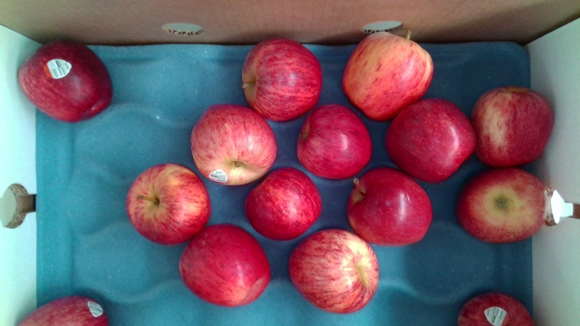
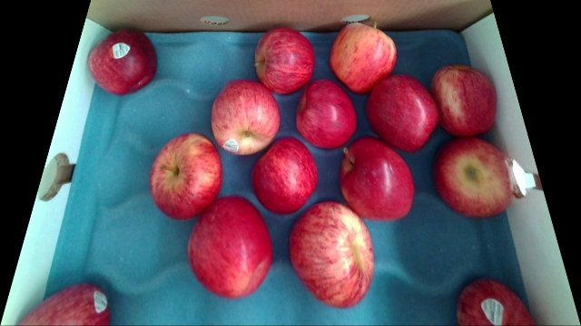

# **Feature Matching**

Dr Frazer Noble

---

# **Introduction**

In this presentation, I will describe:
- How to use OpenCV to match features in an image.

---

# **Requirements**

To follow along with this tutorial, you will need the following tools:
- [Python 3.8.6](https://www.python.org/).
- [Visual Studio Code 1.53.1](https://code.visualstudio.com/).

You will also need to install the following Python packages:
- [OpenCV](https://pypi.org/project/opencv-python/).
- [NumPy](https://pypi.org/project/numpy/).

It is assumed that you are using Windows; however, these instructions should be easily adapted to Linux.

---

# **Getting Started**

Open Visual Studio Code. To open the app: Open the Start menu, type `Visual Studio Code`, and then select the app.

Open the Explorer tab. To display the tab: Left click `View > Explorer` or press <kbd>Ctrl</kbd>+<kbd>Shift</kbd>+<kbd>E</kbd>. This will display the Explorer tab.

Left click on the `Open Folder` button. This will display the Open Folder prompt. Browse to the following directory:

```
C:/Users/%USER%/Documents
```

*Note: Replace `%USER%` with your own username. My username is fknoble; hence, the path is `C:/Users/fknoble/Documents`.*

---

In `C:/Users/%USER%/Documents` create a new folder named `opencv_11`. To create a new folder: Right click in the Explorer tab, left click `New Folder`, and rename it.

In `C:/Users/%USER%/Documents/opencv_11` create a new folder named `data`. Download `apples.PNG` from [here](images/01/01.PNG); save it in `C:/Users/%USER%/Documents/opencv_11/data`.

In `C:/Users/%USER%/Documents/opencv_11` create a new file named `match.py`. To create a new file: Right click on `/opencv_11` in the Explorer tab, left click `New File`, and rename it. The file will open automatically.

---

`/opencv_11` should contain the following files and folders:

```
/opencv_11
    /data
        apples.PNG
    match.py
```

---

# **`match.py`**

Type the following code into `match.py`:

```python
import cv2 as cv
import numpy as np
```

OpenCV's Python module `cv2` is imported as `cv` and NumPy's Python module `numpy` is imported as `np`.

---

Type the following code into `match.py`:

```python
def main():

    img = cv.imread('data/apples.PNG')

    if img is None:
        print('ERROR::CV::Could not read image.')
        return 1
```

This begins `main()`'s definition. `imread()` reads an image from a directory and assigns the results to array `img`. If the array is empty, a message is displayed and `main()` returns 1.

---

Type the following code into `match.py`:

```python
    rows, cols, channels = img.shape
    
    rows = rows // 2
    cols = cols // 2

    img = cv.resize(img, (cols, rows))

    cv.imshow('img', img)
    cv.waitKey(1)
```

`img`'s shape is assigned to integers `rows`, `cols`, and `channels`. `rows` and `cols` are divided by 2 (rounded down) and the results assigned to themselves. `resize()` resizes `img` to shape `cols` x `rows` and the result is assigned to itself. The array is then displayed in the `img` window.

---


*Figure:* The `img` array.

---

Type the following code into `match.py`:

```python
    img = np.float32(img)

    p1 = np.float32([[0, 0], [cols, 0], [0, rows], [cols, rows]])
    p2 = np.float32([[100, 0], [cols-100, 0], [0, rows], [cols, rows]])
    M = cv.getPerspectiveTransform(p1, p2)
```

`float32()` converts `img`'s data to `float32` and assigns the results to `img`. `float32()` creates two arrays of equivalent points and assigns them to arrays `p1` and `p2`. `getPerspectiveTransform()` uses the arrays to compute a transform and assigns the result to array `M`.

---

Type the following code into `match.py`:

```
    warp_img = cv.warpPerspective(img, M, (cols, rows))
    warp_img = np.uint8(warp_img)

    cv.imshow("warp_img", warp_img)
    cv.waitKey(1)
    cv.imwrite("data/warp_img.png", warp_img)
```

 `warpPerspective()` applies the `M` to `img` and assigns the results to array `warp_img`. `uint8()` converts `warp_img`'s data to `uint8` and assigns the results to `warp_img`.The array is displayed in the `warp_img` window and saved as `warp_img.PNG` in `/data`.

---


*Figure:* The `warp_img` array.

---

Type the following code into `match.py`:

```python
    img = np.uint8(img)
    warp_img = np.uint8(warp_img)

    orb = cv.ORB_create(nfeatures=1000)
    kp1, des1 = orb.detectAndCompute(img, None)
    kp2, des2 = orb.detectAndCompute(warp_img, None)
```

`uint8()` converts `img`'s and `warp_img`'s data to `uint8` and assigns the results to `img` and `warp_img`. `ORB_create()` creates an instance of the `orb` feature detector and assigns it to variable `orb`. `orb`'s `detectAndCompute()`detects and computes `img`'s and `warp_img`'s keypoints and descriptors and assigns them to arrays `kp1` and `des1`, and `kp2` and `des2`. The descriptors are used for matching the keypoints in `img` and `warp_img`.

---

Type the following code into `match.py`:

```python
    bf = cv.BFMatcher()

    matches = bf.match(des1, des2)
    matches = sorted(matches, key=lambda x: x.distance)
```

`BFMatcher()` creates an instance of the brute force matcher and assigns it to variable `bf`. `match()` matches keypoints described by `des1` and `des2` and assigns the results to array `matches`. The array is then sorted based on each match's distance.

---

Type the following code into `match.py`:

```
    best_matches = 20
    bf_matched = cv.drawMatches(img, kp1, warp_img, kp2,
                         matches[:best_matches], None, [0, 0, 255])

    cv.imshow("BF Matches", bf_matched)
    cv.waitKey(1)
    cv.imwrite("data/bf_matched.PNG", bf_matched)
```

`drawMatches()` draws the best matches on `img` and assigns the results to array `bf_matched`. The array is displayed in the `bf_matched` window and saved as `bf_matched.PNG` in `/data`.

---


*Figure:* The `bf_matched` array.

---

Type the following code into `match.py`:

```python
    FLANN_INDEX_LSH = 6
    index_settings = dict(algorithm=FLANN_INDEX_LSH,
                          table_number=6,
                          key_size=12,
                          multi_probe_level=1)
    search_settings = dict(checks=50)

    flann = cv.FlannBasedMatcher(index_settings, search_settings)
    
    matches = flann.match(des1, des2)
    matches = sorted(matches, key=lambda x: x.distance)
```

`FlannBasedMatcher()` creates an instance of the FLANN matcher and assigns it to variable `flann`. `match()` matches keypoints described by `des1` and `des2` and assigns the results to array `matches`. The array is then sorted based on each match's distance.

---

```python
    flann_matched = cv.drawMatches(img, kp1, warp_img, kp2,
                         matches[:best_matches], None, [0, 0, 255])

    cv.imshow("FLANN Matches", flann_matched)
    cv.waitKey(0)
    cv.imwrite("data/flann_matched.PNG", flann_matched)

    cv.destroyAllWindows()

    return 0
```

`drawMatches()` draws the best matches on `img` and assigns the results to array `flann_matched`. The array is displayed in the `flann_matched` window and saved as `flann_matched.PNG` in `/data`.

---


*Figure:* The `flann_matched` array.

---

Type the following code into `match.py`:

```python
if __name__ == '__main__':
    
    main()
```

`main()` will be called when the `match.py` is run.

---

# **Run `match.py`**

Open a new terminal in Visual Studio Code. To open a new terminal: Left click `View > Terminal` or press <kbd>Ctrl</kbd>+<kbd>`</kbd>.

Type the following commands into the terminal and then press <kbd>Enter</kbd> after each one:

```
cd ./opencv_11
python match.py
```

This will change the current directory to the `/opencv_11` sub-directory and then run `match.py`.

Press any key to close the windows and stop `match.py`.

---

# **Conclusion**

In this presentation, I have described:
- How to use OpenCV to match features in an image.

---

# **References**

1. [https://docs.opencv.org/](https://docs.opencv.org/).
